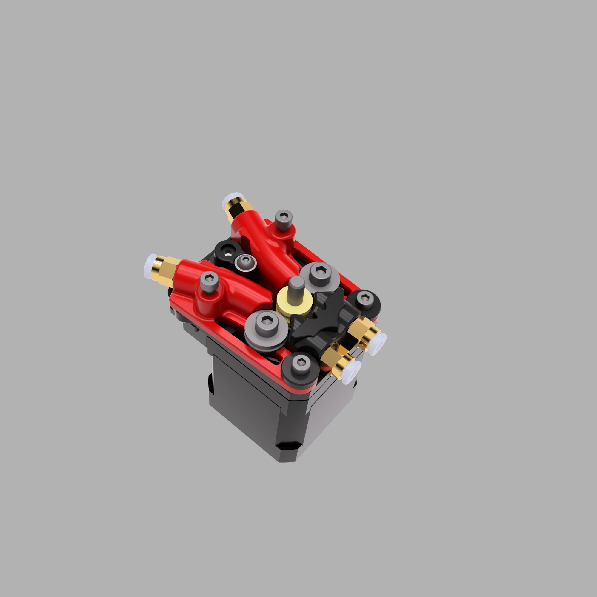
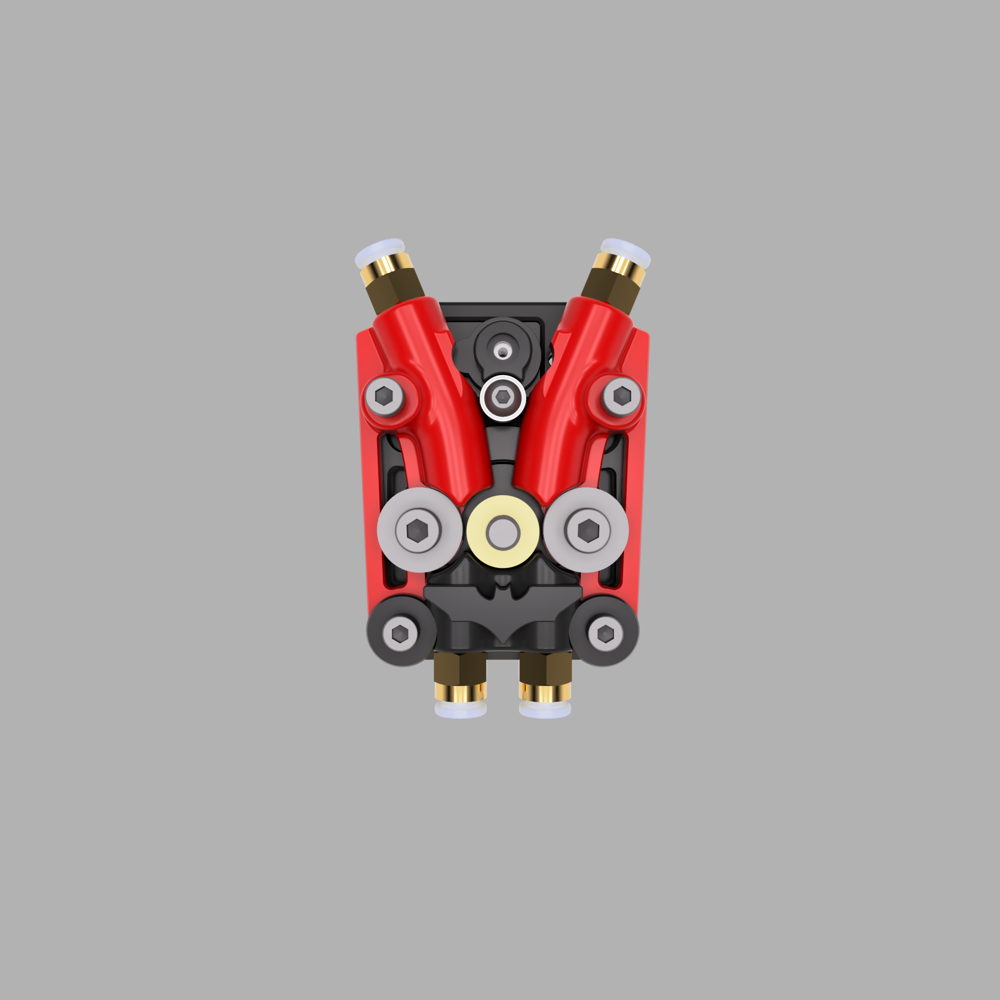
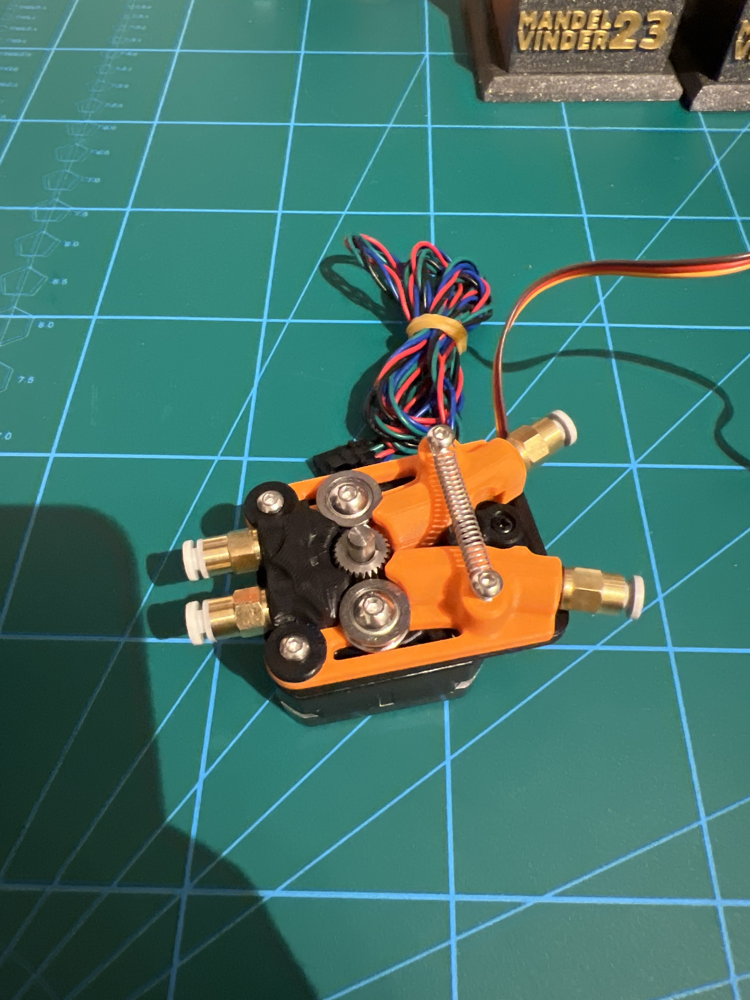
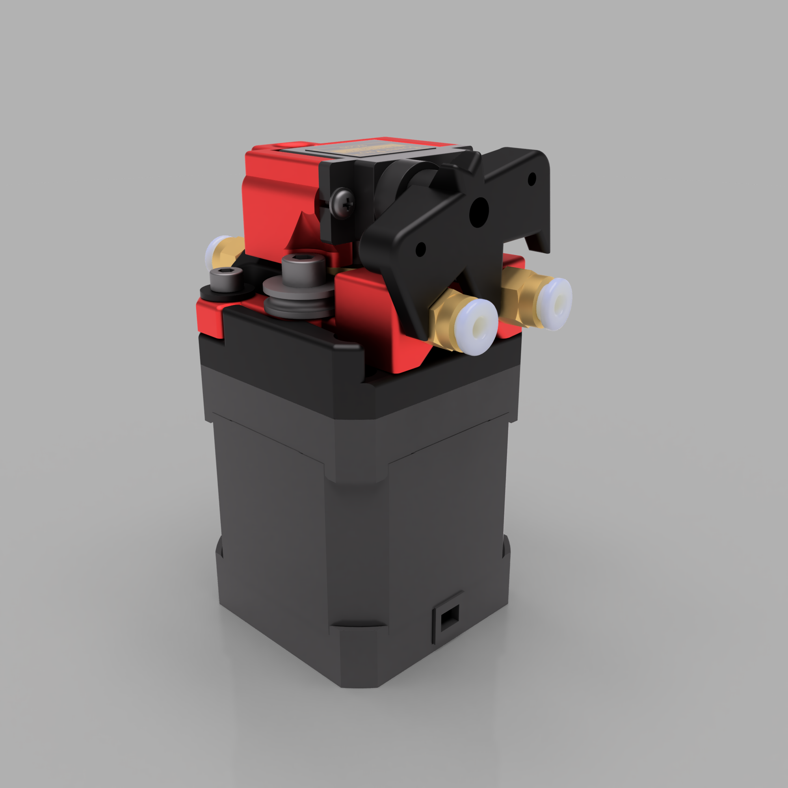
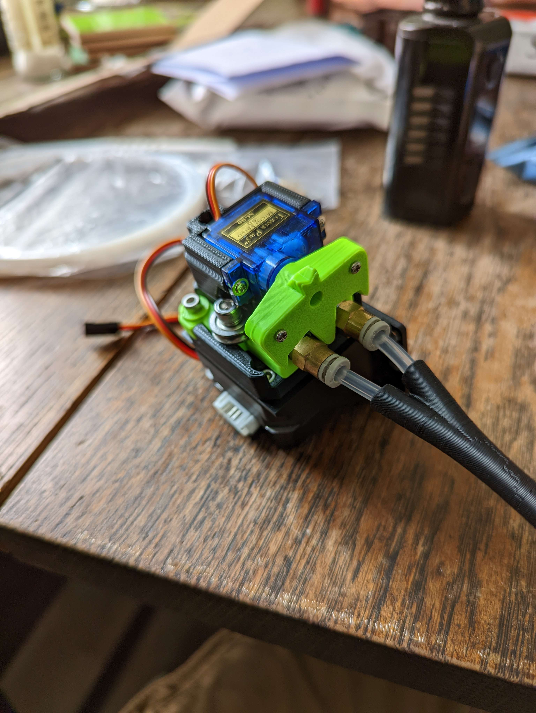
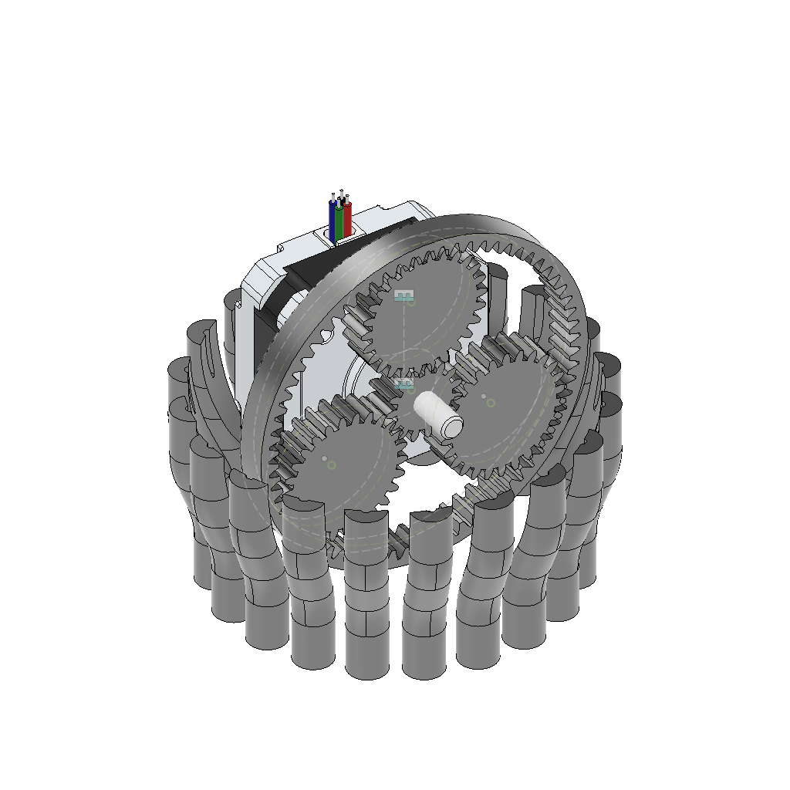

# The BAT MMU - a simple 2 channel MMU

Side view        |  Top view   |  Hr_Ravn view   
:-------------------------:|:-------------------------:|:-------------------------:
  |   |  

Sooo... this is a very old but cool project, I think. I started this project over two years ago, somewhere in 2022, I think. At least, that's when I made the first post about it on Discord. However, let me tell you a bit about the how, why, when, and what's left to do:

### What is this?

It's a two-channel MMU made out of the bare basics you need to swap filaments. That being said, the term MMU, also *Multi* Material Unit, might be a bit over the top as it only swaps two colors (a little spoiler on a crazy idea is at the very end of this page). But two colors are already enough for 95% of the multi-color prints I do, like logos on parts, mesh skirts, and such things. In other words, it's for the lazy people who don't want to swap the colors manually by hand. As another bonus, Bat could also manage two spools on your printer. If you're like me, you print mostly with the same colors, e.g., black and white. So rather than swapping out the filament manually for a (single color) print, you can simply select the filament in the slicer and let the printer check if the correct filament is loaded (that's what I use it for mostly). Or what about a runout manager? In an endless spool mode, Bat *can* / could change the spool once one got empty. There are many use cases for a two-channel MMU, especially for us lazy people.

### How does it work?

Bat is a super simple system which is basically made out of one motor being the extruder and one servo being the selector. Looking at a normal bowden extruder, the motor feeds and retracts one filament by moving back and forward, but for that only *one side* of the extruder is used. Imagine you split a bowden extruder in half and mirror the sides, then you have a filament on each side of it. And this is the basic layout of the Bat MMU. In order to control which filament gets fed / retracted, the servo can move the idler arms on each side of the extruder. By pushing the arm away from the extruder gear, the filament won't move (the filament is deactivated). Due to the spring connection between both arms, the deactivation of one arm (pushing it away) will result in an activation of the other arm. That's it. The only thing we have to account for is that the motor has to spin the other way around for each filament. E.g., a clockwise motor movement feeds Filament A but will retract Filament B. The other way around, we have to invert the motor to feed Filament B / retract Filament A. This might sound a bit confusing, but you can take a look at the little demo video I added to this readme.

#### Demo / Assembly Video

Click on the image to get to the YouTube video:

 

### BOM - What do I need to build one?

Coming from the Ender 3 ecosystem, the Bat MMU reuses basically the stock bowden extruder. Varying hardware shouldn't be too much work; I simply used what I have on hand. Modifying the parts e.g. for BMG gears shouldn't be that hard (due to their gears they would also act as dual drive). After building so many [Papilio's](https://kevinakasam.com/papilio/), I have an army of LGX / HGX extruder gears laying around, I thought about to use for a BAT MMU. But that's future talk.

**Here's what you need to build a Bat MMU and its supported alternatives:** [Google Spreadsheet](https://docs.google.com/spreadsheets/d/1bSXrbz5Jo8a5GIIJkao1ZaGwCmv6FLKUNqkR6fM1aHM/edit?usp=sharing) 

##### Alternatives / Experimentals

__Spring__

You can use a printed spring for testing, but I recommend a metal spring to get more tension on the filament. If your reversed bowden setup is very smooth, the printed one will do the job as well, but I don't have a long-time experience with it.

__Bearing__

You can use a printed bearing on the servo arm instead of a proper bearing. Thanks to Thomas for the idea! All the bearing has to do is to reduce the friction between the servo arm and the filament arms. By having a (printed) bearing on the arm, there aren't any rubbing faces, so the servo has an easier job.

### Why is it called Bat MMU?

In the first versions, the Servo was on top of the MMU unit to switch the arms. The shape of the servo reminded me of a bat, and then I made it look like an actual bat, and yeah, that gave it its name. Now, with the newest revision, the servo has moved, and the arm doesn't look like a bat anymore, but I still modeled one on there, so it's still a Bat MMU 😛 and you can also see the two filament arms as wings, so Bat again.

   

### The elephant in the room: What's left to do? / What the hell is this hacky code?

Yep, that's right. I might have the skills to sketch something up in CAD, but hell no, I'm not a programmer. I don't want to tell you that I spent easily over 100 hours making these Macros because they're kinda hacky. They do work, that's a plus, but it really relies on saving variables which isn't ideal for the system load, it double-checks some things, sometimes it's smarter than you and does unexpected things, and I think I really overcomplicated it. So far, you can use it for swapping filaments or multi-color prints, and it always remembers which filament is loaded, but functions like the mentioned endless spool mode aren't implemented yet.

##### Bugs

Known bugs are that the pausing during an error doesn't really pause the printer as it tries to complete the load/unload sequence, and for some reason, the movement logic for Filament B gets inverted on its own, no matter what the direction variable is set to (so it still does the right thing, but I don't know where it takes the knowledge from to move that way). Also, the idea to add unique Error codes didn't work out as planned because at some point I only used copy and paste and completely lost track of the numbering.

##### My hacky Macros 

As I have zero knowledge about writing any Python code for this, I had to use Klipper Macros to get this done. This means linking the MMU to the extruder for the final loading wasn't that easy, and I had to trick Klipper for that. By using the `[duplicate_pin_override]`, I could trick Klipper to believe that there are two motors on the MMU, one for feeding the filament to the extruder and one that *extrudes* the filament together with the actual extruder to load it into the nozzle (synced movement between MMU and extruder for loading). That way, the `manual_stepper BATMMU_stepper` and the `extruder_stepper BATMMU_extruder_stepper` are completely identical in the setup for pins, etc., but can be used differently with Klipper. The `manual_stepper BATMMU_stepper` takes care of all the filament movements to the extruder entry; from that point on, the `extruder_stepper BATMMU_extruder_stepper` does all movements together with the actual extruder till the toolhead sensor is triggered.

In short: The Code works, but the Code is evil.

##### My Dream of Happy Hare

It would be a dream to get [Happy Hare](https://github.com/moggieuk/Happy-Hare) support on this, but I don't know how as there's no homing sequence with an endstop involved (my code relies on the saved loaded filament variables), and we don't even have a selector. I think that could be a fun challenge, and if it works, we have a wonderful Bat MMU because the design itself works perfectly fine and so does Happy Hare.

### Are two channels all we can get?

Mh, no. I have two ideas I want to share with you. First, imagine a stack of two Bat MMUs on one stepper, so with two arms per side on top of each other. All they need are two more positions on the servo arm so still only one of the arms is activated / 3 are deactivated. I already started that at some point but never made it to a real design.

Second idea: Add a planetary drive. This will only make sense to you if you're familiar with planetary drives. Planetary drives have the advantage of having three moving components. Setting one as an input, there are always two left that can act as an output. This is partially correct as one of the two has to be stationary to make the planetary work. But setting the Sun as the input (the motor), there are the planets as output if the ring is stationary, or the ring as output if the planets are stationary. You can play around with that in this very cool simulator (https://www.thecatalystis.com/gears/) or watch this simulation: https://www.tec-science.com/wp-content/uploads/2018/09/en-planetary-gear-operation-modi.mp4

So maybe you got my idea already, but with a servo, we should be able to switch the planetary drive between these two output modes. This also means that one output can act as a selector and the other as a feeder. I started with a circular design with the planetary drive in the middle and all the filament paths around it. With that, you can theoretically use an infinite amount of filaments with the MMU; all you have to do is to increase the diameter of the planetary drive. An alternative idea was to use a more linear setup like from the ercf where the planetary gear drives along. All this is still very much in the "I had an idea" state, but I think this is super exciting as you could get infinite channels out of 10€ hardware.

